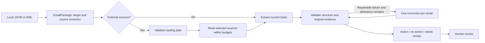

# Current architecture: v2.0 core with v3 application

Final submission documentation, 3 October 2026. The runtime retains the v2 task contract and optional v3 application. The measured experiment originated at c405d29. English localization records original/current hashes; it changes review language and equivalent Unicode spelling, not model responses or decisions. Real Google connectivity remains unverified.

There is one model client and a bounded Python workflow, not an open-ended agent loop. Long inputs use overlapping segments and a complete candidate ledger for merging. Summaries are not evidence. An entire email shares one validation-repair allowance across planning, segments, merge and short extraction; transport errors, valid review decisions, unread required material and exhausted budgets do not cause retries.

## Modules and boundaries

| Module | Owns |
| --- | --- |
| `ingestion/`, `domain/email.py` | JSON/EML parsing; actual target, headers, timestamps, body, thread and attachment/link inventory |
| `content/` | Bounded extraction for text, HTML, CSV, text-based PDF, DOCX, XLSX; source hashes/locations; allowlisted HTTPS transport |
| `workflow/coverage.py`, `context.py` | Reading-plan contract, segment budgets and actual source availability |
| `workflow/multi_pipeline.py` | Planning, reading, extraction, merging and deterministic validation |
| `workflow/repair.py`, `guardrails/matching.py` | Shared repair allowance and bounded original-quote suggestions |
| `reasoning/`, `guardrails/evidence.py` | Model API, parsing, exact quote alignment and output checks |
| `evaluation/` | Immutable runs, cost preflight, approved reference comparison and owner reviews |
| `interfaces/` | CLI and a local single-column benchmark review UI |

The old `workflow/pipeline.py` and v1 parser are retained compatibility code. V2 currently shares source normalization with that module. They are live dependencies of the CLI, source normalization and rule comparisons, rather than dead code.

## Public decision and policies

V2 returns exactly `status`, `actions`, `reason`, `evidence`. Each action has `kind`, `text`, `deadline`, `evidence`. Array length is the count; at most three independently completable tasks are supported. Same-deliverable substeps normally form one action. Optional comments for consideration alone are no action; a concrete request to consider, decide or reply can be an action. Preserve the sender's level of commitment.

The target recipient is explicit. Older requests apply only when renewed by the newest message. Bodies use `thread:N`; original historical headers use `thread:N:headers`. Missing execution access or business inputs do not erase an identifiable request. Explicit missing document dependencies can require review.

Body content comes first. Read required external task details and links that carry the main message; skip unrelated reports, footer links and background. Skipped, unread and successfully read are different states. Never cite unseen content or claim it was checked.

Evidence must match supplied original text. Safe whitespace alignment and known MailEx soft wraps can restore an exact original span. Similarity only locates correction candidates; even a 98.5% match cannot approve a changed amount. Numeric/unit/date/negation markers are diagnostics, not complete semantic validation. Repairs are checked against the same stage's supplied sources, never hidden full documents. Both replies, usage and repair outcome are saved. A validated quote proves provenance, not that the paraphrased task is semantically correct or complete.

ISO deadlines require explicit resolvable source information. Relative dates use trustworthy received time and timezone; absence of that anchor stays null. Independent semantic date resolution is not implemented. File limits, corrupt/archive checks, missing cached spreadsheet values, private-network destination controls and source coverage produce visible review reasons. Scanned PDFs, legacy DOC/XLS, login-dependent pages and JavaScript-only pages are unsupported.

## V3 application boundary

`interfaces/workflow_cli.py` is a thin offline entry point to the same persistent service, with a repeatable demo and JSON source/analysis/history output. Existing extraction and evaluation CLIs retain real-model experiments. The CLI/core must work without account integration. The GUI remains an optional review interface. UiPath integration is not implemented. The owner finalized core experiments and deferred the real Gmail/Calendar loop as optional enrichment.

`application/store.py` persists private messages, analysis, reviewed proposals and calendar outcome history in SQLite. `application/service.py` invokes the same extraction workflow and owns explicit analyze/review/draft/confirm/write/export operations, unchanged-content deduplication, call caps and crash recovery. `integrations/mail.py` normalizes selected Gmail MIME/thread data into `EmailPackage`; `integrations/auth.py` manages separately enabled desktop OAuth features. `integrations/calendar.py` translates approved drafts into Google event payloads or ICS and reconciles stable operation IDs. `interfaces/app_server.py` serves a separate single-column mail/review/task product UI. Its default uses artificial provider responses and scripted model replies, clearly labelled in the UI. Detailed Google contracts and limits are recorded below.

Calendar drafts require accepted tasks and complete user-reviewed dates; confirmation belongs to one saved revision. Changes invalidate it. A write is persisted before sending; unknown outcomes are reconciled without blind retry. No provider capability is exposed to the model. Rejected tasks cannot become calendar items. Private application records are independent of frozen evaluation evidence.

## Deployment boundary

The benchmark UI still reviews saved runs; the product UI is a separate application mode. Only one service uses port 61933 at a time. Gmail/OAuth/Calendar code is implemented against official interfaces and fake responses; real authorization and API writes are deferred. ICS export and the local product path work offline. No automated replies, external task execution or mailbox monitoring exists. Private content, API keys and provider tokens remain outside Git and ordinary evaluation logs. Default private files are local plaintext, not an encrypted vault; the service is for a single local user/process.

## Google integration contracts and offline verification

Checked against Google documentation on 1 October 2026. Owner decision: Gmail and Google Calendar only, interface implementation first, real-account testing deferred. No Google credentials, real mail, paid model calls or real calendar events were used in this slice.

## Official declarations

Both services provide REST documentation and machine-readable Discovery specifications:

- [Gmail reference](https://developers.google.com/workspace/gmail/api/reference/rest), [Gmail v1 Discovery](https://gmail.googleapis.com/$discovery/rest?version=v1).
- [Calendar reference](https://developers.google.com/workspace/calendar/api/v3/reference), [Calendar v3 Discovery](https://www.googleapis.com/discovery/v1/apis/calendar/v3/rest).
- [Desktop OAuth](https://developers.google.com/identity/protocols/oauth2/native-app), [Gmail quickstart](https://developers.google.com/workspace/gmail/api/quickstart/python), [Calendar scopes](https://developers.google.com/workspace/calendar/api/auth).

The application uses an injectable REST transport and Google's optional Python OAuth libraries. It does not require the full generated API client to run the offline demo.

| Operation | Interface used |
| --- | --- |
| Actual account/target | `GET /gmail/v1/users/me/profile`, `emailAddress` |
| Inbox summaries | `GET /gmail/v1/users/me/messages`, then metadata-only message retrieval |
| Selected message | `GET /gmail/v1/users/me/messages/{id}?format=full` |
| Selected thread | `GET /gmail/v1/users/me/threads/{id}?format=full` |
| Detached MIME bytes | `GET /gmail/v1/users/me/messages/{id}/attachments/{attachmentId}` |
| Owned destinations | `GET /calendar/v3/users/me/calendarList?minAccessRole=owner&maxResults=100` |
| Create item | `POST /calendar/v3/calendars/{calendarId}/events?sendUpdates=none` |
| Reconcile item | `GET /calendar/v3/calendars/{calendarId}/events/{stableEventId}` |

Gmail uses `gmail.readonly` and exposes no mailbox send/update/delete operation. Calendar separately requests `calendar.events.owned` and `calendar.calendarlist.readonly`. The first integration requires the calendar primary account to match Gmail, and supports calendars owned by that account. Calendar listing stops at 100 entries; a known owned ID can also be entered manually.

Gmail `internalDate` supplies the received anchor, converted to the explicitly configured application timezone (default `Asia/Singapore`). The authored Date header does not override it. Thread messages are sorted by anchor; replies later than the selected message are excluded. Historical headers and attachment inventories retain distinct original-source IDs. MIME bytes, HTML/plain text and detached attachment content reach the existing ingestion/reading core. Lists fetch metadata only, while selection fetches a bounded thread and its declared attachment bytes. The cap is 50 thread messages and 20 MiB of combined body/attachment content, with visible failure on overflow.

Calendar uses `date` and exclusive end for all-day items, or offset-bearing `dateTime` and IANA `timeZone`. Dates, order and timezone offsets are checked. No attendees, invitations or conference details are added. Transparent availability keeps deadline items from automatically reserving busy time. See [event creation](https://developers.google.com/workspace/calendar/api/guides/create-events) and [events.insert](https://developers.google.com/workspace/calendar/api/v3/reference/events/insert).

## Test-data provenance and limits

No ready-to-use official inbox dataset or account-free sandbox was found in the documentation reviewed. Google's client library documents [mock HTTP responses](https://googleapis.github.io/google-api-python-client/docs/mocks.html); these test application interactions without proving real connectivity.

[demo_mail.json](../src/actionmail/integrations/demo_mail.json) contains authored synthetic Google-shaped responses: an attachment-dependent task, an informational message, a missing-workbook review and historical thread context. It is not Google-provided data, a captured inbox, or an AI accuracy dataset. Fixed `DemoModel` replies pass through the unchanged v2 reading/validation workflow. Other imported messages receive an explicitly labelled simulation review, not model inference. These fixtures are outside the active frozen 60-case registry.

Engineering checks cover target/time/MIME/thread normalization, attachment preservation, timezone boundaries, OAuth refresh and denied scopes through fakes, review/edit/rejection persistence, unchanged-message deduplication, confirmation invalidation, cancellation, duplicate clicks, event-ID conflict and timeout/crash reconciliation. Existing evaluation sources, hashes, model replies and owner judgments remain untouched.

## Local storage and effects

SQLite stores mail, private content hashes, analysis, reviewed proposals, drafts and outcome history independently of evaluation records. Windows default storage is `%LOCALAPPDATA%/ActionMail`. This is plaintext local storage protected by user-account permissions, not encrypted credential storage. OAuth tokens are separate per feature. Disconnect removes local credentials and disables the running feature while retaining saved mail/tasks; it does not revoke the Google grant. Revocation can be performed in Google Account settings.

Task acceptance does not authorize calendar writing. Each saved draft has a revision and operation key. Edits invalidate confirmation. The single application service serializes writes and saves `writing` before sending. A stable Google event ID and matching private operation property allow duplicate detection. Unknown transport/write outcomes and interrupted writes stay `unknown`; repeated clicks and restarts cannot resend. Reconciliation checks the existing event. A 404 stays unknown because it may be transient; unresolved or conflicting outcomes require manual resolution. Do not run two application processes against one store.

Confirmed ICS export uses stable UID, CRLF, text escaping, UTF-8-safe 75-octet folding and date/UTC fields. Export is recorded separately from an API write. The preview's destination is advisory for ICS: the importing calendar app selects the actual destination. The offline provider persists simulated events beside the demo store and labels every simulated outcome.

Actual OAuth authorization, real Gmail fetch, real Calendar creation and private-mail/model submission remain unverified. Organization policies, account permissions and live provider behavior must be checked later with owner approval. Do not claim production integration reliability from fake responses. A future smoke test should use one authored email and a selected test calendar, separate analysis-transmission consent and explicit final event confirmation; a new paid full benchmark is not required.

## English localization

Owner-authorized localization translates existing review explanations and analysis labels without changing verdicts, numeric metrics, fees or model responses. Archived originals and current hashes are recorded in experiments/results/english_localization.json. The snapshot negation regex keeps multilingual behavior through equivalent Unicode escapes.
