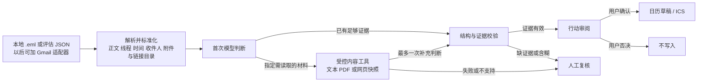

# ActionMail 架构草案（历史版本）

当前架构以 Git 仓库中的 [English architecture](ActionMail/docs/architecture.md) 为准；本文件保留早期讨论记录。

版本：2026-09-28。目标是在 10 月 4 日前做出可运行、可复现、可解释的个人课程项目。此文件是设计，不代表功能已经实现。

## 1. 设计决定

| 维度 | 首版决定 | 原因 / 边界 |
|---|---|---|
| 运行地点 | 本地独立 Python 程序，用户主动提交一封邮件，按需处理 | 不依赖邮箱账户审核；不做实时收件箱监控或插件 |
| 代码形式 | `.py` 模块 + README + 评估数据/脚本，提交 GitHub 仓库 | Timeline 要求可运行代码和仓库，没有规定最终项目必须交 notebook |
| 编排 | 自己用 Python 写明确的步骤和最多一次补充读取循环；不依赖 UiPath | 同一流程可在 50 例上复现、逐步记录，解决已提交 §5 的路线冲突；最终报告解释改变 |
| 模型 | 一个可替换的 API 模型负责理解和提取；规则负责输入限制、证据校验、确认和外部写入门禁 | 不把安全决策交给模型；记录实际模型、token、成本与延迟 |
| 用户界面 | 先有命令行输入/结果审阅；核心稳定后做最薄的本地审阅页面（若时间允许） | 视频可演示真实运行；界面不决定核心逻辑 |
| 外部写入 | 模型只能建议；用户确认后才可生成日历草稿/`.ics` | 首版无自动发送邮件、改动邮箱或直接写日历 |

## 2. 一条端到端路径



模型第一次看到目标收件人、邮件时间/时区、主题、正文/必要线程，以及附件和链接的**目录**。它只能回答：`action`、`no_action`、`needs_review`，或请求读取一个明确的附件/链接。代码检查请求是否合法，再读取最多两个资料源并作一次补充模型判断。不得无限循环或浏览任意网站。“无法读取”必须变成 `needs_review`，不能误判为 `no_action`。

## 3. 输入与输出约定

**统一输入 `EmailPackage`：**`case_id`、`target_recipient`、`received_at`（含时区）、`subject`、`sender`、`to/cc`、当前正文、按时间排序的线程消息、附件清单、链接清单。每个正文、附件或网页快照有稳定的 `source_id`。本地 `.eml` 用 Python 标准库 MIME 解析；将来 Gmail 也只需转换成相同格式。Gmail API 支持取完整邮件及附件，但邮箱授权是独立工作，不阻塞本地流程。参考：[Python email parser](https://docs.python.org/3/library/email.parser.html)、[Gmail message format](https://developers.google.com/workspace/gmail/api/reference/rest/v1/Format)。

**输出 `ActionResult`：**

```json
{
  "status": "action | no_action | needs_review",
  "action": "具体、面向目标收件人的行动；否则为 null",
  "deadline": "明确的 ISO 8601 日期或日期时间；否则为 null",
  "evidence": [{"source_id": "body | thread:1 | attachment:1 | link:1", "quote": "来源原文"}],
  "review_reason": "证据不足、时间含糊、多项行动或材料无法读取时填写"
}
```

首版将 0 或 1 项行动作为自动处理范围。若一封邮件包含多项不同承诺，输出 `needs_review`，不静默挑一项。只有**当前目标收件人**需要做事才是 `action`；发送者自己的承诺和纯通知是 `no_action`。相对日期须以邮件时间及时区解析；不明确的日期保持 `null` 或转人工复核。

## 4. 模块边界

```text
actionmail/
  schema.py       输入输出结构与枚举
  ingest.py       .eml / JSON → EmailPackage；以后可另加 Gmail 适配器
  content.py      受限读取 .txt/.pdf 和固定网页快照
  model.py        模型 API 调用与 token/延迟记录
  pipeline.py     首次判断、有限补充读取、二次判断
  policy.py       证据核对、拒答、确认与外部动作门禁
  rules.py        非 AI 关键词基线
  cli.py          单例运行与人工确认
evaluate.py      同一评估集上的运行、评分、逐例结果导出
data/dev/        调试样例；不计入最终结果
data/eval/       冻结的 50 例输入及人工标准答案
README.md        安装、运行、来源、限制与结果复现
```

无需数据库。测试邮件、标准答案、运行记录均用 JSON/JSONL，密钥只从环境变量读取，绝不提交到仓库。默认不记录私人邮件原文；正式评估只用可公开或可合规使用的样例。

## 5. 评估如何嵌入架构

- 同一 50 例运行**规则基线**和**模型主方案**，输出 TP/FP/FN/TN、precision、recall、正确拒绝数；行动、截止时间和证据分别计正确数。评估标签先冻结。50 例的类别配额见 `PROJECT_RESTART_BRIEF.md`。
- 对 10 个附件/链接挑战例，再运行一次“只看正文”和一次“允许补充读取”。这样可以回答多步工具路径带来了多少收益，以及额外 token、成本和延迟。它不是另造一个无界 Agent。
- 每例保存输入 ID、模型版本、提示词版本、访问过的 source_id、输出、校验结果、耗时、token 和成本；不报告未实际运行的数字。评估与演示调用同一个 `pipeline.py`，避免演示走另一套逻辑。
- 证据校验只承认已读取来源中真实出现的引用；引用不能证明行动对象、行动内容或时间时转人工复核。附件/网页文字一律是**不可信数据**，不能覆盖系统指令。

## 6. 故障与扩展边界

| 情况 | 系统行为 |
|---|---|
| 无 API 密钥、模型超时或返回无效结构 | 记录失败，提供规则结果供参考；不自动写入 |
| PDF 无可提取文字、附件格式不支持 | 标记 `needs_review`，显示缺失的来源 |
| 网页需登录、下载失败或内容变化 | 使用评估中冻结的网页快照；实际运行转人工复核 |
| 模型给出找不到的证据或编造截止时间 | 拒绝自动结果，标记 `needs_review` |
| 用户未确认 | 不生成可导入的日历结果，更不调用写入 API |

网页读取在评估中使用固定快照以保证复现；演示时可选一个明确允许的公开 HTTPS 页面做实际抓取。任意外部 URL、重定向或内网地址不在首版的自动抓取范围内。

未来才考虑：Gmail OAuth、Outlook、多用户、实时触发、更多附件格式、直接写日历、独立 ML 分类器。若添加 Gmail，先只读；`gmail.readonly` 是 restricted scope，公开部署需要额外的授权与数据处理评估。参考：[Gmail API scopes](https://developers.google.com/workspace/gmail/api/auth/scopes)。

## 7. 实施顺序

1. 固定 `EmailPackage`/`ActionResult`、行动判定规则和少量开发样例。
2. 跑通 `.eml/JSON → 一次模型调用 → 结构化输出 → 证据校验 → 人工审阅`。
3. 加规则基线及 50 例评估器，冻结标准答案并记录成本/延迟。
4. 加附件与网页快照的有限读取路径，完成正文与工具路径对照实验。
5. 生成可录制的演示、README 和 ≤1,200 词的分析；真实邮箱接入仅在核心结果稳定后尝试。

**验收句：**从一封此前未用于调试的邮件出发，系统给出可追溯的行动或明确拒绝，用户能审核；对 50 例生成逐例记录和真实计数，另一台机器可按 README 复现。
