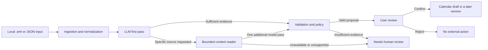

# ActionMail Architecture

| Item | Value |
| --- | --- |
| Architecture revision | 0.1 |
| Target MVP | v1.0 |
| Status | Design; no implementation is claimed here. |

## 1. Decision: LLM, rules, ML, or agent?

These are not four mutually exclusive products. They serve different roles.

| Approach | Decision | Role and reason |
| --- | --- | --- |
| Rule matching | Include | A cheap, transparent non-AI baseline. Rules also enforce validation and confirmation gates; baseline predictions and safety rules remain separate code paths. |
| LLM | **Primary approach** | Interpret the current message and relevant thread context, then propose a recipient-specific action, explicit deadline, and evidence. The model and prompt version are recorded for every run. |
| Traditional ML classifier | Defer | MAILEx labels email events and arguments, but not the exact target-recipient action contract. Training a fair classifier would require a separately labeled training set and extra experiments. It may be added only after the main system and evaluation work. |
| Agent | Use only as bounded tool use | When the first model pass identifies a specific missing attachment or linked page, code may read an allowed source and ask the model once more. The model cannot browse freely or write to external systems. |

Python owns orchestration. UiPath is not used in the runnable path. This resolves the inconsistent build description in the submitted formative statement. The final analysis should state the change and its observed trade-offs, without claiming an unperformed UiPath trial.

## 2. System boundary

The application is a **local, on-demand, standalone Python program**. Its initial input is a saved `.eml` file or an evaluation JSON record. A mail-provider adapter can be added later without changing the decision pipeline. A small command-line review flow is sufficient for v1.0; a local visual review page is optional once the core is stable.



The evaluation runner calls the same pipeline as the interactive entry point. It must not use a separate, easier implementation.

## 3. Core contracts

`EmailPackage` contains a case ID, target recipient, sender and recipients, a timezone-aware received timestamp, subject, current body, ordered thread messages, and attachment/link descriptors. Each readable segment has a stable `source_id`. Ingestion normalizes source text before evidence matching and preserves the original source reference.

`ActionResult` contains:

```json
{
  "status": "action | no_action | needs_review",
  "action": "string or null",
  "deadline": "ISO 8601 date or datetime, or null",
  "evidence": [{"source_id": "body", "quote": "exact source excerpt"}],
  "review_reason": "string or null"
}
```

Only an obligation or request directed at the **target recipient** counts as an action. A sender's own commitment or an informational event is not enough. The first version automatically handles zero or one action. Multiple distinct actions, uncertain recipients, unsupported content, and ambiguous deadlines produce `needs_review` rather than a fabricated answer. A missing deadline can remain `null` when the action itself is clear.

## 4. Package boundaries

The extra directory level keeps each core concern small. The paths below are **planned**, not empty modules that already exist.

```text
src/actionmail/
  domain/
    email.py             EmailPackage, source descriptors, recipient identity
    decision.py          ActionResult, statuses, evidence references
  ingestion/
    eml.py               MIME parsing and body/attachment inventory
    fixtures.py          JSON evaluation input
    normalize.py         Common EmailPackage conversion and text normalization
  reasoning/
    prompts.py           Versioned extraction instructions
    model_client.py      Provider-neutral model call and usage contract
    openrouter.py        OpenRouter implementation
    response.py          Parse and validate model response structure
  content/
    attachments.py       Bounded text/PDF extraction
    links.py             Frozen page snapshots; optional allowlisted HTTPS fetch
  guardrails/
    evidence.py          Match quoted spans to sources actually read
    deadlines.py         Check date/time representation and ambiguity
    policy.py            Tool limits, review routing, confirmation gate
  workflow/
    pipeline.py          First pass, optional source read, final decision
    trace.py             Per-run steps, source IDs, tokens, latency, and errors
  baselines/
    rules.py             Non-AI comparison predictor
  interfaces/
    cli.py               Local input and user review
    calendar.py          Future confirmed calendar draft/ICS output
evaluation/
  cases.py               Load and validate frozen cases and labels
  metrics.py             Confusion counts and extraction checks
  runner.py              Compare baseline and pipeline on the same cases
data/dev/                Development cases, excluded from final metrics
data/eval/               Frozen 50-case evaluation inputs and labels
README.md
```

Dependencies point inward: adapters and interfaces depend on the domain contracts; the workflow composes them; the domain has no model, UI, or provider dependency. In particular, the model client cannot invoke a calendar writer. Only the review interface may request a confirmed output through the policy gate.

## 5. Bounded workflow

1. Parse the message and identify the target recipient, timestamp, body, thread, and available source descriptors.
2. Send the first model call only the necessary text and the attachment/link inventory. The model returns a decision or a request for a named `source_id`.
3. Validate the requested source against the inventory and type/size/step limits. Read at most two sources, then make at most one additional model call. A failed read routes to `needs_review`, never `no_action`.
4. Validate the final structure and check that every quoted evidence span occurs in a source the system actually read. Resolve relative dates against the email timestamp and timezone; leave uncertain dates unresolved.
5. Present the result to the user. No calendar or mailbox write occurs in v1.0.

Attachment and page text are data, not instructions. Evaluation uses frozen linked-page snapshots for repeatability. A later live-page demonstration may fetch only an explicitly allowed public HTTPS URL; arbitrary URLs and internal network addresses are outside the first version.

## 6. Evaluation and observability

The held-out set is 50 cases in four groups: 15 no-action, 15 explicit-action, 10 context-dependent, and 10 attachment/link cases (five of each). Ground truth is fixed before the final run. MAILEx is a candidate source for real email cases, but its event labels must be reviewed and mapped manually; authored attachment/link cases are recorded separately.

The rule baseline and LLM pipeline run against the **same cases**. Report TP, FP, FN, TN, precision, recall, correct no-action decisions, correct abstentions, and action/deadline/evidence correctness as counts. The ten challenge cases also compare a body-only model run with the bounded content workflow. Record model and prompt versions, source IDs read, token usage, per-case cost, latency, and errors. Never present planned targets as measured results.

The 50 cases are deliberately stratified and do not estimate real inbox prevalence. Development cases stay outside the held-out set. Model failures and unsupported formats are reported, not silently discarded.

## 7. Version gates

- **v1.0:** A new local email reaches one model call, a structured result, deterministic evidence checks, and user review. No tool loop is required to call this first slice complete.
- **v1.1:** The same pipeline and a rule baseline run over frozen cases with real counts, usage, latency, and cost.
- **v1.2:** Supported attachment/page sources can be read through the bounded workflow, with a body-only comparison and failure routing.

Live Gmail OAuth, Outlook, continuous polling, autonomous calendar writes, and a trained ML classifier are not dependencies of these gates.
