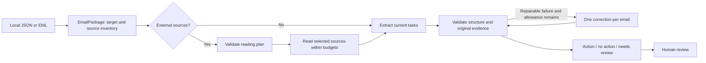

# Current architecture: v2.0 baseline

Updated 1 October 2026. This describes implemented code. v3.0 proposals are in [handoff.md](handoff.md).

There is one model client and a bounded Python workflow, not an open-ended agent loop. Long inputs use overlapping segments and a complete candidate ledger for merging. Summaries are not evidence. An entire email shares one validation-repair allowance across planning, segments, merge and short extraction; transport errors, valid review decisions, unread required material and exhausted budgets do not cause retries.

## Modules and boundaries

| Module | Owns |
| --- | --- |
| `ingestion/`, `domain/email.py` | JSON/EML parsing; actual target, headers, timestamps, body, thread and attachment/link inventory |
| `content/` | Bounded extraction for text, HTML, CSV, text-based PDF, DOCX, XLSX; source hashes/locations; allowlisted HTTPS transport |
| `workflow/coverage.py`, `context.py` | Reading-plan contract, segment budgets and actual source availability |
| `workflow/multi_pipeline.py` | Planning, reading, extraction, merging and deterministic validation |
| `workflow/repair.py`, `guardrails/matching.py` | Shared repair allowance and bounded original-quote suggestions |
| `reasoning/`, `guardrails/evidence.py` | Model API, parsing, exact quote alignment and output checks |
| `evaluation/` | Immutable runs, cost preflight, approved reference comparison and owner reviews |
| `interfaces/` | CLI and a local single-column benchmark review UI |

The old `workflow/pipeline.py` and v1 parser are retained compatibility code. V2 currently shares source normalization with that module. Do not archive them without moving this shared dependency and updating callers; replacing this boundary is a later small refactor, not a reason to rewrite the application.

## Public decision and policies

V2 returns exactly `status`, `actions`, `reason`, `evidence`. Each action has `kind`, `text`, `deadline`, `evidence`. Array length is the count; at most three independently completable tasks are supported. Same-deliverable substeps normally form one action. Optional comments for consideration alone are no action; a concrete request to consider, decide or reply can be an action. Preserve the sender's level of commitment.

The target recipient is explicit. Older requests apply only when renewed by the newest message. Bodies use `thread:N`; original historical headers use `thread:N:headers`. Missing execution access or business inputs do not erase an identifiable request. Explicit missing document dependencies can require review.

Body content comes first. Read required external task details and links that carry the main message; skip unrelated reports, footer links and background. Skipped, unread and successfully read are different states. Never cite unseen content or claim it was checked.

Evidence must match supplied original text. Safe whitespace alignment and known MailEx soft wraps can restore an exact original span. Similarity only locates correction candidates; even a 98.5% match cannot approve a changed amount. Numeric/unit/date/negation markers are diagnostics, not complete semantic validation. Repairs are checked against the same stage's supplied sources, never hidden full documents. Both replies, usage and repair outcome are saved. A validated quote proves provenance, not that the paraphrased task is semantically correct or complete.

ISO deadlines require explicit resolvable source information. Relative dates use trustworthy received time and timezone; absence of that anchor stays null. Independent semantic date resolution is not implemented. File limits, corrupt/archive checks, missing cached spreadsheet values, private-network destination controls and source coverage produce visible review reasons. Scanned PDFs, legacy DOC/XLS, login-dependent pages and JavaScript-only pages are unsupported.

## Deployment boundary

The current UI reviews benchmark runs; it is not an inbox application. No mailbox OAuth, user database, calendar export/write or external task execution exists. V3 should add a thin adapter/service/UI around the same extraction core. Keep authentication, confirmation and external effects outside model control. Local review port is 61933. Private content, API keys and provider tokens belong outside Git and ordinary evaluation logs.
