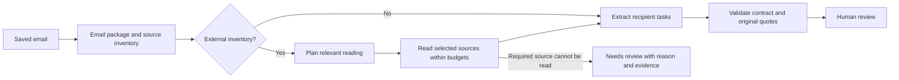

# ActionMail architecture

Updated 1 October 2026. This describes the current v2 implementation. V1 remains available for historical comparison. V2 acceptance is pending live validation of the latest fixes.

## Processing flow

Short emails need one extraction call, plus planning when an external inventory exists. Long inputs use bounded overlapping segments and a merge of the complete candidate ledger. There is no open-ended agent loop, automatic correction retry or external write operation.

## Responsibilities

| Area | Responsibility |
| --- | --- |
| `ingestion/`, `domain/email.py` | Preserve newest message, older message headers, target address and available attachment/link inventory. |
| `workflow/coverage.py` | Reading-plan schema, relevance policy, segmentation and budgets. |
| `content/` | Bounded file/page extraction, provenance, office/archive limits and allowlisted link transport. No action classification. |
| `workflow/context.py` | Build extraction context from supplied text, inventory and validated reading choices. Distinguish read, deliberately skipped and not supplied. Never infer unseen contents. |
| `workflow/multi_pipeline.py` | Coordinate planning, reading, extraction, segment merge and validation. No case-specific exceptions. |
| `reasoning/`, `guardrails/` | API calls, response parsing, deadline/schema checks and exact original-evidence validation. Historical response compatibility stays at the parsing boundary. |
| `evaluation/` | Versioned cases, reference comparison, saved model traces and owner adjudication. Reference labels are never included in model prompts. |
| `interfaces/` | CLI and local review UI. They display/save judgments and do not execute mail tasks. |

The current model result has only `status`, `actions`, `reason`, and `evidence`. Each action has its own kind, text, deadline and quotes. The maximum is three independently completable tasks. The workflow uses `reason/evidence` directly; old explanation/review-reason accessors are retained to read history and preserve compatibility.

## Reading and missing-content policy

- Read external content when the newest body assigns source-dependent work or delegates its main message to that content. A brief "Project details are posted at [link]" is a primary-content pointer, even without an explicit task in the body.
- Skip footer/signature/promotional links and unrelated background accompanying a self-contained body. Skipped content must not enter model context.
- Pass validated reading reasons and actual availability to every extraction/merge path. Planning reasons are interpretations, not authoritative instructions or proof of unseen contents.
- An empty inventory means no external material was supplied. The model must still recognize an explicitly referenced missing dependency, citing email text without inventing an attachment identity. A current request to review unavailable material requires review.
- Older requests create no new obligation unless renewed by the newest body for the target. Preserve older headers rather than assuming that every historical request serves the current target.

These are semantic model responsibilities. Deterministic code validates source availability, evidence, budgets and output structure; it does not force `no_action` based on keywords or silently replace a model judgment. Offline scripted tests establish context delivery and failure routing, not that a live model will always interpret the rules correctly.

## Evaluation boundary

The active suite consists of the frozen 50 and ten approved supplementary cases, with hash-bound v2 reference amendments. Raw runs, original scores, reference amendments and owner judgments remain separate. `evaluation/references.py` owns status/count comparison for both the runner and amended review display; it does not claim semantic correctness from a count match.

The suite includes snapshots and synthetic fixtures. Its results do not establish real-inbox prevalence, general prompt-injection resistance or universal live-link support. Live model validation and human acceptance remain necessary before v2 release.
