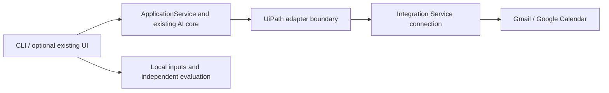

# UiPath Gmail and Calendar integration assessment

Date: 2 October 2026. Status: design and effort assessment only; implementation has not started. The owner confirmed access to Automation Cloud's Integration Service / Connections page. Existing Gmail connection state, folder permissions, consumables and callable operation metadata have not been inspected.

## Decision

Recommend a bounded feasibility check, followed by thin adapters only if it passes. Complexity is medium for local ActionMail calling Integration Service; migrating the extraction core into UiPath is a materially larger project and is not recommended for the current assignment.

The independent Python CLI/core/evaluation remains usable without UiPath installation, login or mailbox/calendar connection. Connecting UiPath enables the optional live provider path. GUI/TUI are not prerequisites. Existing evaluation inputs, references, saved results and review judgments remain intact.

Effort estimates below are engineering judgments, not vendor guarantees or measurements from a live integration. The normal budget is **10–18 focused person-hours**, including integration debugging and contingency, assuming usable cloud permissions and a supported local invocation path. Plan roughly two focused workdays, depending on owner availability for authorization. A favorable case with working connections and complete schemas may take 6–8 hours. Tenant policy/entitlement blockers or a need to deploy robot workflows could expand elapsed time to 2–4 days or longer; stop and report rather than silently expanding scope.

Given the owner-reported 4 October deadline, the first 1–2 hours must produce a clear go/no-go decision. Waiting for administrator approval is not included in person-hours and cannot be bounded by code work.

## Evidence and unknowns

| Area | Evidence | Consequence |
| --- | --- | --- |
| Python integration | Official SDK exposes `connections.list`, metadata discovery and `invoke_activity` | A local Python adapter is a documented direction; publishing the whole application is not inherently required |
| Local environment | Project environment is Python 3.12.14; UiPath SDK not installed there; `uip` not found on this shell's PATH | Python meets the SDK's documented 3.11+ prerequisite; package/tool setup remains. This does not prove tools are absent elsewhere on the machine |
| Cloud access | Owner can open Connections | Cloud UI access is established; API authorization, folder access and connector operation rights remain unverified |
| Mail activities | Official Google Workspace package documents email list, get-by-ID, thread and attachment operations | Required operations exist in the platform ecosystem; Studio activities are not proof that all are callable through local Python/IS metadata |
| Calendar activities | Create, list calendars and get-by-ID are documented; Create Event uses a Gmail connection | Gmail and Calendar do not necessarily need different connector families; actual scopes and supported inputs must be checked |
| Google authorization | Gmail connector supports UiPath public OAuth app; its default permissions include Gmail and Calendar access | Can reduce Google Cloud setup for a test account, but permissions are broad and sign-in/consent still occurs |
| Generic HTTP fallback | Google Workspace HTTP Request is documented; generic Workspace connection currently requires a custom OAuth client | May preserve Google API JSON and permit reuse of existing adapters, but must not be promised as a zero-setup fallback |
| UiPath authorization | External app connection read scope is user-only; requests require folder context | A bare app ID/secret is not a demonstrated replacement for an authorized local user session |
| Calendar reliability | Existing adapter uses deterministic event IDs and a private operation marker | Any new invocation must preserve those properties or implement an equally reliable reconcile method before live writes |

The cloud tenant was not queried, the SDK was not installed, Google accounts were not read, and events were not created during this assessment. No new model calls were made. The removed teacher CLI guide is not part of the integration plan.

## Proposed architecture and route selection

UiPath owns the authorized provider connection and executes provider operations. ActionMail owns mail normalization, AI interpretation, evidence, task review, confirmation, persistence and outcome reconciliation.

Prefer the existing Gmail connection and operations available in actual Integration Service metadata. Start with read-only discovery through `uip`, if installed, and verify one local Python SDK call. Do not translate a Studio class name into a guessed `ActivityMetadata` payload.

There are two possible adapter implementations, selected after discovery:

1. **Managed HTTP with raw Google-shaped JSON**, if supported by the selected connection and local invocation path. Add `integrations/uipath.py` implementing the existing `request(method, url, body)` boundary, translating only allowlisted operations into discovered UiPath requests. Reuse `GmailAdapter` and `GoogleCalendarAdapter`. Verify the actual base URL, Gmail/Calendar routing, JSON envelopes, status codes and write retry policy. Gmail's JSON/base64 attachment endpoint fits a JSON-only transport, but path/base-URL access must be demonstrated. Never replace this with direct Google calls while labelling the result UiPath integration.
2. **Native connector operations**, if they expose the complete required data. Add thin `UiPathMailAdapter` / `UiPathCalendarAdapter`, mapping returned objects to `MailRecord` / `EmailPackage` and the existing calendar contract. Preserve thread boundaries, original text and attachment bytes. A transformed `.NET` email object or a file reference may require additional retrieval/decoding; estimate this only after seeing a real output. Do not silently discard context to fit a convenient response shape.

Do not assume exporting a Google token from a connection is allowed: the external API explicitly omits secret tokens. The SDK's token method does not prove availability to this user's external caller. Token export is not the proposed route.

The `uip` developer CLI and Python package's `uipath` CLI are distinct tools with different setup/auth flows. Do not assume their login state is shared. Use documented authorization for the selected SDK version, keep credentials private, and require user participation for browser sign-in. Pin the tested SDK version and add an optional dependency only; lazy imports keep the existing Python 3.10+ core usable while the UiPath path requires 3.11+.

## Detailed conditional build plan

The plan starts only after the owner chooses to proceed; it does not authorize live writes or private-email inference by itself.

| Stage | Estimate | Work | Exit criterion |
| --- | --- | --- | --- |
| 0. Feasibility gate | 1–2 h | Check tooling/auth, confirm organization/tenant/folder and connection selection, ping, discover actual operations/schemas, verify a bounded local read and calendar listing | Local invocation works; required mail data and safe calendar creation/retrieval have a demonstrated or schema-supported route |
| 1. Mail adapter | 2–4 h | Bounded list/fetch; correct account, To/Cc, received timestamp, current message and older thread; attachment bytes; paging/error mapping | Known controlled messages and one attachment reach the unchanged `EmailPackage` workflow without losing original sources |
| 2. Calendar adapter | 2–3 h | Resolve owned destination; date/timezone mapping; stable operation ID; creation/result lookup; distinguish failure from unknown outcome | Offline contract checks preserve no-write-before-confirmation, repeated-write protection and unknown-outcome locking |
| 3. Application and CLI binding | 1–2 h | Shared provider construction, optional UiPath mode/config, explicit fetch/analyze/confirm/write commands; reuse existing UI entry if needed | Provider can be selected explicitly; local/evaluation commands start without UiPath credentials or SDK imports |
| 4. Live validation and regression | 2–3 h | Controlled mail reads, separately approved test-calendar write and read-back, repeat command/restart, account/permission failures, offline regression | End-to-end evidence supports each integration claim; no duplicate event; core evaluation evidence remains unchanged |
| Contingency | 2–4 h | SDK/metadata mismatch, auth refresh, envelopes/encoding and transient failures | Resolve within budget or report precise blocker and stop |

### Stage 0: prove connectivity before broad coding

- Confirm a specific tenant/folder and connection with the owner. Opening the Connections page does not prove scope/role access. Check connection health without fetching inbox contents.
- Check the actual plan's Integration Service entitlement and remaining usage. Do not purchase, provision products or change organization-wide policies.
- Discover whether mail list/get/thread/attachment and calendar list/create/get are directly callable. For managed HTTP, inspect support and base URL rather than inventing endpoints.
- Verify local authenticated SDK read access using a small, owner-selected controlled message or approved profile/calendar read. No calendar POST at this stage.
- Inspect the creation schema for client-supplied event ID/private marker, notification controls and all-day/timed support. If the native operation omits needed fields, assess managed HTTP immediately.
- Test receipt/body fidelity and identify attachment representation: inline base64, bytes, URL or job attachment reference. Do not download unrelated private content.

**Stop criteria:** after two focused hours, no permitted local invocation; missing mail/thread/attachment fidelity with no small supported alternative; no dependable create/reconcile strategy; required entitlement/admin approval unavailable; or the only path requires deploying a robot, new workflow backend or moving the AI application into UiPath. Report the blocker and revised estimate before further work.

### Stages 1–3: implementation boundaries

Proposed files, subject to discovered schemas:

| File/area | Intended change |
| --- | --- |
| `integrations/uipath.py` | Session/config checks, discovered connector invocation, status/envelope normalization; transport or thin native adapters |
| `integrations/providers.py` | Small shared factory for demo, existing Google path and optional UiPath path; avoid duplicate initialization in CLI/UI |
| `interfaces/workflow_cli.py` | Explicit provider selection and live operations while preserving offline defaults; distinguish scripted from real model analysis |
| `interfaces/app_server.py` | Optional provider selection using the same service and factory; no new frontend project |
| `pyproject.toml` | Optional tested SDK dependency and Python-version guard for the integration path |
| `tests/test_uipath_integration.py` | Recorded sanitized response contracts and meaningful behavior/error checks |

Preserve API errors such as denied scope, unavailable connection, wrong folder and rate limit; provide actionable messages. Never retry event POST automatically. If the SDK wraps or retries requests internally, inspect its behavior and disable unsafe retries or reject that route.

Calendar confirmation continues to apply to one exact saved revision and destination. The provider response must yield an event ID, and reconciliation must verify the operation marker where supported. If only server-generated IDs are available, a durable lookup strategy is required for timeout-after-create; searching a title alone is insufficient. Keep timed and all-day deadlines separate, no invented date for unknown deadlines, no attendees/invitations, and transparent availability.

### Stage 4: what “full path works” means

Use controlled messages delivered/prepared by the owner and a designated test calendar. Preparation/sending mail and any real calendar creation/deletion require explicit scope approval; they are not performed during this assessment.

1. Verify message list and selection against Gmail; compare target, header fields and received time with the original.
2. Read a short current email, an older-thread example, one attachment-dependent example and one missing-material example. Check actual bytes/source references, not just visible subject lines.
3. First exercise integration with scripted decisions or a manually reviewed draft, isolating provider/auth bugs from model behavior. Those checks establish connectivity only.
4. For a genuine AI end-to-end demonstration, run one separately authorized controlled message through the real model, review evidence/task, then explicitly confirm the destination and exact event fields.
5. Create one test event, retrieve it, and verify title/date/timezone/destination; repeat the write command and restart to prove no second event is created. Test cancellation and stale confirmation offline.
6. Simulate timeout-after-send, permission denial, expired authorization and rate limit offline. In an unknown write state, reconcile before considering any retry. Do not deliberately disturb unrelated live connections to test failure handling.
7. Run appropriate regression tests and source integrity checks. Do not launch another paid full model evaluation or modify frozen references/results.

Completion means controlled Gmail input → unchanged AI core → reviewed task → exact confirmation → UiPath-backed Google Calendar event → read-back and recorded outcome. ICS export or a simulated event alone does not establish calendar integration. One passing account path is a project smoke test, not production reliability across organizations.

## Official sources checked

- [Python SDK connections: invocation and metadata](https://uipath.github.io/uipath-python/core/connections/).
- [SDK setup and local authentication; Python 3.11+](https://uipath.github.io/uipath-python/core/getting_started/).
- [SDK folder and environment configuration](https://uipath.github.io/uipath-python/core/environment_variables/).
- [Integration Service from coding agents and CLI](https://docs.uipath.com/integration-service/automation-cloud/latest/user-guide/use-integration-service-with-coding-agents).
- [Gmail authentication and public-app scopes](https://docs.uipath.com/integration-service/automation-cloud/latest/user-guide/uipath-google-gmail-authentication).
- [Gmail activities](https://docs.uipath.com/activities/other/latest/productivity/gmail-activities) and [Get Email Thread](https://docs.uipath.com/activities/other/latest/productivity/google-workspace-get-email-thread-connections).
- [Calendar activities](https://docs.uipath.com/activities/other/latest/productivity/google-workspace-calendar-activities) and [Create Event using a Gmail connection](https://docs.uipath.com/activities/other/latest/productivity/google-workspace-calendar-create-event-connections).
- [Google Workspace HTTP Request](https://docs.uipath.com/activities/other/latest/productivity/google-workspace-general-http-request-connections) and [generic Workspace custom OAuth requirements](https://docs.uipath.com/integration-service/automation-cloud/latest/user-guide/uipath-google-workspace-authentication).
- [External API scopes, folder context and secret omission](https://docs.uipath.com/integration-service/automation-cloud/latest/user-guide/api-access).
- [Gmail attachment JSON/base64 endpoint](https://developers.google.com/workspace/gmail/api/reference/rest/v1/users.messages.attachments/get) and [Calendar insertion contract](https://developers.google.com/workspace/calendar/api/v3/reference/events/insert).
