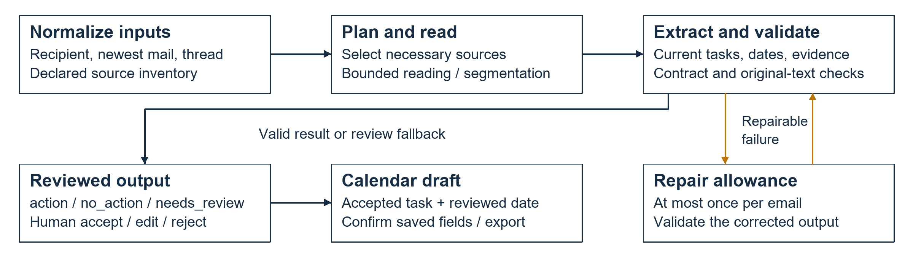
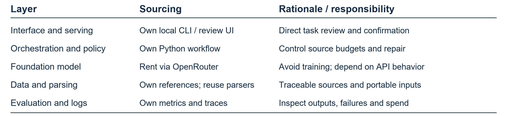
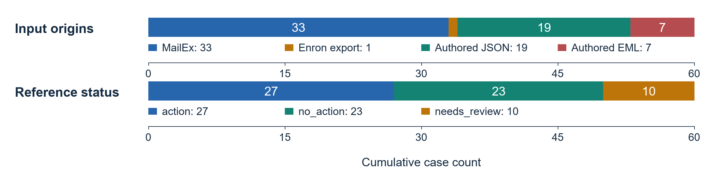
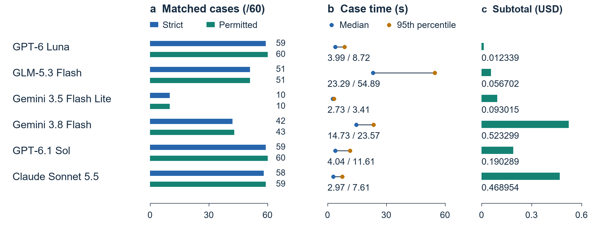
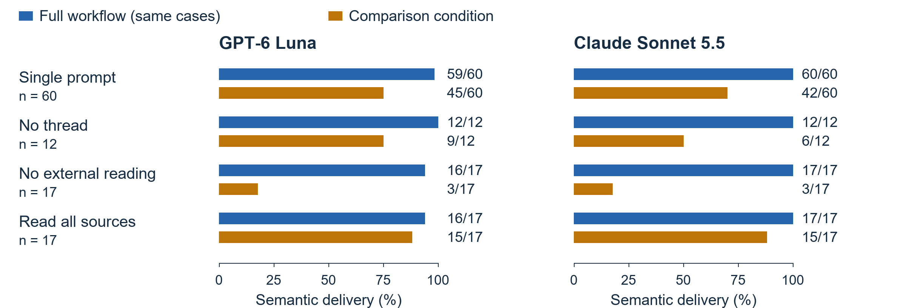
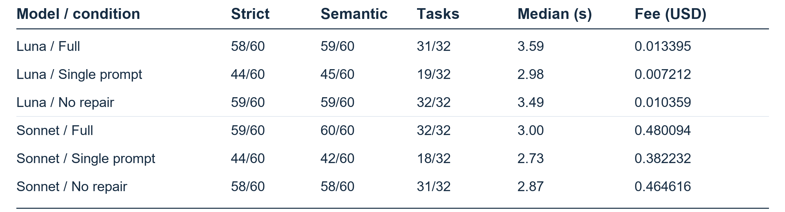

# ActionMail: Evidence-backed email task identification

PE6201 - Individual course project report

## Problem and objectives
ActionMail supports a project coordinator identifying current obligations for a named recipient across the newest email, its thread and necessary attachments. Missed requests leave deliverables unfinished; overstated obligations create unnecessary work. Gmail provides email-to-task creation, including tasks from Gemini summary cards [1](#ref-gmail). This project examines recipient-specific interpretation through an inspectable workflow and measures the quality, latency and cost of alternative designs.

The system returns action, no_action or needs_review, with up to three independent tasks, resolvable explicit deadlines and original-text evidence. Success requires useful task delivery rather than status agreement alone, following outcome-based evaluation [2](#ref-evals). Action precision and recall of at least 90% were pre-specified for shortlisting ablation models, subject to semantic review.

## System design and boundaries
The workflow normalizes inputs, inventories sources, selectively reads necessary material, extracts tasks and validates structure and evidence ([Figure 1](#fig-architecture)). Long content is segmented and merged. One repair allowance is shared across planning, extraction and merging; similarity locates correction candidates but cannot approve changed facts [3](#ref-architecture). Older requests require renewal in the newest message, optional suggestions retain their commitment level, and missing decisive material triggers review. Exact quotation matching establishes provenance, not semantic completeness.

*Figure 1. Workflow and human review. Amber arrows denote bounded repair; black arrows denote controlled processing.*

Foundation-model inference is rented through OpenRouter; domain policy, orchestration, review and evaluation remain locally controlled, applying layer-specific own/rent decisions [4](#ref-ownrent) ([Table 1](#tab-ownership)). Python replaced the proposed UiPath approach to support explicit source budgets, reproducible traces and controlled experimental conditions. UiPath was not implemented or benchmarked. This choice avoids model training and a vector database for declared sources, while retaining maintenance and compatibility responsibilities.

*Table 1. Ownership by layer. CLI: command-line interface; UI: user interface.*

The delivered application includes a local CLI, persistent accept/edit/reject review, calendar drafts and ICS calendar-file export. Google adapters were tested offline with artificial responses; real Gmail authorization and Calendar writes remain unverified. The demonstration uses authored emails and scripted model replies. Calendar operations require accepted tasks and confirmation of saved fields; automated replies, task execution and background inbox monitoring are outside scope.

## Evaluation design
The evaluation uses 60 development/regression cases ([Figure 2](#fig-data)), with separate recipient-obligation references rather than MailEx's original event/argument labels [5](#ref-mailex). Seventeen cases contain 20 source entries: 13 attachments and seven links. Twelve attachments and all links are authored; supplied file bytes and page snapshots do not establish natural workplace provenance or live browsing.

*Figure 2. Input origins and strict reference statuses (60 cases). Segment widths represent counts; each row totals 60.*

Dataset, references, business code (c405d29) and request configuration were frozen before formal runs. Benchmark initial requests differed only in model, with temperature 0 and a 2,048-token output cap. API-enforced JSON and provider pinning were absent. Six models contributed 360 observations; Luna and Sonnet contributed 500 ablation observations with fresh complete-workflow controls. Strict status, permitted status/count and semantic delivery are distinguished. Semantic delivery additionally requires task matching, faithful ownership, commitment, deadlines, evidence and justified review. Codex assisted code, examples and annotation; its 500 semantic reviews use saved owner judgments as anchors, not independent human assessment. C11's alternative interpretation was allowed beforehand. The benchmark lacks equally exhaustive semantic review.

## Results and trade-offs
The deterministic body/subject baseline matched 31/60 statuses, with action precision of 60% and recall of 44.4% [6](#ref-experiment). Its narrower source-reading and multi-task capabilities make this a system-level comparison. The six-model results show that interface behavior materially affects delivery ([Figure 3](#fig-benchmark)). Flash Lite's fenced JSON caused every case to end in review; its 10/60 matches are not successful task extractions. Flash's repeated format failures exhausted the shared repair budget, while GLM's effective output budget and provider variation complicate interpretation; OpenRouter can route a model across providers [7](#ref-routing). These are workflow-and-routing outcomes, not universal model rankings.

*Figure 3. Six-model comparison, 60 cases per model. Strict: exact status; permitted: pre-approved status/count. Lines join median and 95th-percentile times, not confidence intervals. Panel c shows generation-verified service-fee subtotals.*

Complete-workflow semantic delivery was 59/60 for Luna and 60/60 for Sonnet, versus 45/60 and 42/60 for single prompts ([Figure 4](#fig-ablation)). Without external reading, both fell to 3/17. Reasonable abstention avoids unsupported guesses but still leaves tasks undelivered. Removing threads reduced delivery from 12/12 for both models to 9/12 and 6/12. Reading all sources unnecessarily blocked S07 on an irrelevant unreadable footer link: selective planning adds a call but limits avoidable failure exposure.

*Figure 4. Semantic delivery on identical case subsets. Bar-end labels show passes/cases; n denotes paired emails.*

Repair restored C12's explanation and evidence without changing its review status. [Table 2](#tab-metrics) therefore separates status, semantic delivery and task-unit matching. Independent first answers differ across arms, preventing a causal claim that repair consistently improves total scores.

*Table 2. Ablation quality, latency and service fees. Luna: GPT-6 Luna; Sonnet: Claude Sonnet 5.5. Strict and semantic columns count email passes; tasks are matched/expected obligation units. Fees cover each 60-case arm.*

Complete-workflow median latency was 3.59 seconds for Luna and 3.00 for Sonnet. Their per-case service fees were approximately USD 0.000223 and 0.008002, a 35.8-fold difference, favoring Luna's measured cost/quality trade-off. Total spend was USD 3.224528503 against a USD 5 cap. Sonnet's benchmark verified subtotal of USD 0.468954 excludes one missing generation bill; total spend uses usage-counter differences [6](#ref-experiment). Human review, hosting, storage, deployment effort and actual time savings were not measured, so low inference spend does not establish commercial ROI [8](#ref-costs).

## Limitations and next steps
Cases were reused for tuning and regression, initially with Luna, allowing hidden adaptation and optimistic results. Single benchmark trials and repeats on eight selected cases cannot establish generalization. Warm caches, routing and output compatibility affect measured outcomes. Source limits and hostile fixtures demonstrate specific protections, not comprehensive prompt-injection resistance; private email transmission also requires deliberate controls.

Priorities are an unused test set with independent human review, fixed-first-answer repair replay and JSON-schema transport on compatible endpoints [9](#ref-structured). Using the outcome criteria in [Evaluation design](#sec-evaluation), review time and useful task completion should be measured before making business-value claims.

Typesetting and logo asset adapted from Chen Wang's NTU template [10](#ref-template);
  logo placement follows NTU's brand guide [11](#ref-brand).

## References

[1] Google. [Create a task in Gmail](https://support.google.com/mail/answer/9920317?hl=en).

[2] NTU (2026). PE6201: Evals as a layer, Class 2 C4, pp. 3-7; Steer it and prove it, Class 3 C2, pp. 9-10, 13-15. Course slides.

[3] ActionMail (2026). Architecture and offline demonstration documentation. Project records.

[4] NTU (2026). PE6201: Build-vs-buy, Class 2 C2, pp. 2-3. Course slides.

[5] Srivastava et al. (2023). [MailEx: Email Event and Argument Extraction](https://aclanthology.org/2023.emnlp-main.801/). EMNLP, 12964-12987. DOI: [10.18653/v1/2023.emnlp-main.801](https://doi.org/10.18653/v1/2023.emnlp-main.801).

[6] ActionMail (2026). Experiment report, sections 2, 11-12; billing clarification. Project records.

[7] OpenRouter. [Provider Routing](https://openrouter.ai/docs/guides/routing/provider-selection). API documentation.

[8] NTU (2026). PE6201: What does it actually cost?, Class 5 C2, p. 21. Course slides.

[9] OpenRouter. [Structured Outputs](https://openrouter.ai/docs/guides/features/structured-outputs). API documentation.

[10] C. Wang. [NTU Ph.D. Thesis Template](https://github.com/wang-chen/thesis_template_ntu). GitHub. MIT license.

[11] NTU (2018). [Quick Brand Guide](https://www3.ntu.edu.sg/CorpComms2/NTU%20Quick%20Brand%20Guide%202018.pdf).
